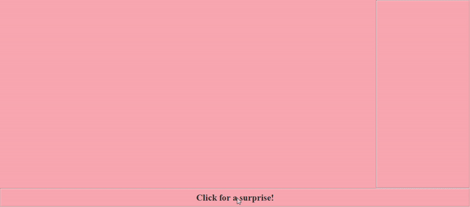

# Shapes and Messages
This is a multithreaded shape and message renderer that I created to practice graphics programming best-practices in Java that utilizes rendering threads and double buffering to speed up rendering.

